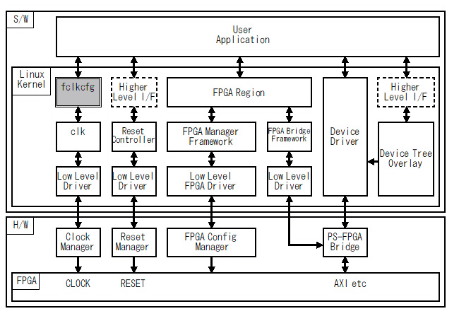

FPGA Clock Configuration Device Driver
======================================

# はじめに


## fclkcfg とは


fclkcfg は FPGA Clock Configuration Device Driver で、ユーザー空間から Zynq/Zynq UltraScale+ の PL(Plogrammable Logic) のクロックの周波数を変更および出力を制御するデバイスドライバです。


## 構成


fclkcfg はLinux Kernel が本来持っている clk ドライバを、ユーザー空間から制御できるようにします。




Fig.1 fclkcfg の位置づけ

<br />


## 対応プラットフォーム


*  OS: Linux Kernel Version 4.4.4 以降
*  CPU: ARM(Zynq-7000), ARM64(Zynq UltraScale+)

現在(2016年4月8日)、Altera-SoC で動作確認中ですがまだ動いていません。


# インストール


## ビルド


Makefile を用意しています。環境にあわせて適当に修正してください。


## インストール


insmod で fclkcfg のカーネルドライバをロードします。その際 Device Tree の設定に従いデバイスドライバができます。Device Tree に関しては後述します。


```console
zynq# insmod fclkcfg.ko
[  102.044387] fclkcfg amba:fclk0: driver installed.
[  102.049016] fclkcfg amba:fclk0: device name   : fclk0
[  102.053949] fclkcfg amba:fclk0: clock  name   : fclk0
[  102.058748] fclkcfg amba:fclk0: clock  rate   : 100000000
[  102.058748] fclkcfg amba:fclk0: clock  enable : 1

```


## アンインストール


アンインストールするには rmmod を使います。


```console
zynq# rmmod fclkcfg
[  261.514039] fclkcfg amba:fclk0: driver unloaded
```

## Debian Package によるインストール

詳しくは以下の URL を参照してください。

*  https://github.com/ikwzm/fclkcfg-kmod-dpkg

# デバイスツリー


fclkcfg はデバイスツリーでクロックの設定をします。具体的には次のようなデバイスツリーを用意します。


```devicetree:devicetree.dts
		fclk0 {
			compatible    = "ikwzm,fclkcfg";
			device-name   = "fpga-clk0";
			clocks        = <&clkc 15>, <&clkc 2>;
			insert-rate   = "100000000";
			insert-enable = <1>;
			remove-rate   = "1000000";
			remove-enable = <0>;
		};

```


以下にデバイスツリーのプロパティの説明をします。


## compatible プロパティ


compatible プロパティはカーネルモジュールの中から対応するデバイスドライバを探すためのキーワードを示します。fclkcfg では "ikwzm,fclkcfg-0.10.a" または "ikwzm,fclkcfg" を指定します。compatible プロパティは必須です。


## device-name プロパティ


device-name プロパティはデバイス名を文字列で指定します。device-name プロパティはオプションです。device-name プロパティが省略された場合は、devicetree のノード名(例では fclk0)がデバイス名になります。


## clocks プロパティ


clocks プロパティの第一引数で制御する PL のクロックを指定します。

clocks プロパティの第二引数以降で PL の リソースのクロックを指定します。

clocks プロパティは必須です。ただし第一引数は必須ですが第二引数以降はオプションです。

clocks プロパティで指定するクロックは、<クロックのハンドル クロックのインデックス> で指定します。例えば Zynq の場合、次のようにデバイスツリーでクロックが指定されています。


```devicetree:zynq-7000.dtsi
/dts-v1/;
		:
	      (中略)
		:
		slcr: slcr@f8000000 {
			#address-cells = <1>;
			#size-cells = <1>;
			compatible = "xlnx,zynq-slcr", "syscon", "simple-bus";
			reg = <0xF8000000 0x1000>;
			ranges;
			clkc: clkc@100 {
				#clock-cells = <1>;
				compatible = "xlnx,ps7-clkc";
				fclk-enable = <0>;
				clock-output-names = "armpll", "ddrpll", "iopll", "cpu_6or4x",
						"cpu_3or2x", "cpu_2x", "cpu_1x", "ddr2x", "ddr3x",
						"dci", "lqspi", "smc", "pcap", "gem0", "gem1",
						"fclk0", "fclk1", "fclk2", "fclk3", "can0", "can1",
						"sdio0", "sdio1", "uart0", "uart1", "spi0", "spi1",
						"dma", "usb0_aper", "usb1_aper", "gem0_aper",
						"gem1_aper", "sdio0_aper", "sdio1_aper",
						"spi0_aper", "spi1_aper", "can0_aper", "can1_aper",
						"i2c0_aper", "i2c1_aper", "uart0_aper", "uart1_aper",
						"gpio_aper", "lqspi_aper", "smc_aper", "swdt",
						"dbg_trc", "dbg_apb";
				reg = <0x100 0x100>;
			};
		:
	      (中略)
		:

```


このデバイスツリーではクロックの設定は slcr(System Level Control Register) の clkc で行うことを示しています。


clocks = <&clkc 15>; と記述することにより、  clkc が管理しているクロックの15番目のクロック(これが PL Clock 0を指す)を制御することを指定します。


clocks の第二引数以降で PL の リソースのクロックを指定しています。PL のクロックは、リソースのクロックを分周することにより必要な周波数のクロックを出力しています。clocks の第二引数以降で、PL のリソースのクロックを "armpll"、"ddrpll"、 "iopll" の何れかから選択することができます。"armpll" は <&clkc 0>、"ddrpll" は <&clkc 1>、"iopll" は <&clkc 2> です。

clocks = <&clkc 16>, <&clkc 2>; と記述することにより、clkc が管理している16番目のクロック(これが PL Clock 1を指す)を制御することを指定し、かつ clkc の管理している2番目のクロック(これが "iopll" を指す)をリソースクロックとして選択することを指定します。

第二引数が省略された場合は、Linux Kernel の起動時に設定されていたリソースクロックが選択されます。


&clkc の代わりに phandle を使って指定することもできます。phandle は デバイスツリーを dtc (Device Tree Compiler) で dtb に変換するときに dtc によって割り当てられる整数値です。例えば dtc によって clkc の phandle が 5 に設定された場合、clocks = <5 15>  と指定する事で PL Clock 0 を制御することが出来ます。


Linux を起動する時に読み込むデバイスツリーがシンボル情報を含んでいない場合があります。このようなデバイスツリーで起動した Linux の場合、デバイスツリーオーバーレイで使うデバイスツリーに &clkc のようなシンボルは使えません。この場合は次のように clkc の phandle の値を明示的に指定する必要があります。


```devicetree:fclk0-zynq-zybo.dts
/dts-v1/;
/ {
	fragment@0 {
		target-path = "/amba";
		__overlay__ {
			fclk0 {
				compatible  = "ikwzm,fclkcfg";
				clocks      = <5 15>;
			};
		};
	};
};

```

### Zynq で指定できる clocks プロパティ

Zynq の場合 clocks に指定できるプロパティは次の通りです。

Table.1 Zynq のクロック

| Clock Name  | Index  | Property Value   | Description |
|-------------|--------|------------------|-------------|
| armpll      | 0      | <&clkc 0>        | ARMPLL 第二引数でのみ指定可 省略可 |
| ddrpll      | 1      | <&clkc 1>        | DDRPLL 第二引数でのみ指定可 省略可 |
| iopll       | 2      | <&clkc 2>        | IOPLL 第二引数でのみ指定可 省略可 |
| fclk0       | 15     | <&clkc 15>       | PL Clock 0 第一引数でのみ指定可 |
| fclk1       | 16     | <&clkc 16>       | PL Clock 1 第一引数でのみ指定可 |
| fclk2       | 17     | <&clkc 17>       | PL Clock 2 第一引数でのみ指定可 |
| fclk3       | 18     | <&clkc 18>       | PL Clock 3 第一引数でのみ指定可 |


### ZynqMP で指定できる clocks プロパティ

ZynqMP の場合 clocks に指定できるプロパティは次の通りです。

Table.2 ZynqMP のクロック (linux-xlnx v2018.2)

| Clock Name  | Index  | Property Value   | Description |
|-------------|--------|------------------|-------------|
| iopll       | 0      | <&clkc 0>        | IOPLL. 第二引数でのみ指定可 省略可 |
| rpll        | 1      | <&clkc 1>        | RPLL.  第二引数でのみ指定可 省略可 |
| dpll_to_lpd | 8      | <&clkc 8>        | DPLL.  第二引数でのみ指定可 省略可 |
| pl0_ref     | 71     | <&clkc 71>       | PL Clock 0. 第一引数でのみ指定可 |
| pl1_ref     | 72     | <&clkc 72>       | PL Clock 1. 第一引数でのみ指定可 |
| pl2_ref     | 73     | <&clkc 73>       | PL Clock 2. 第一引数でのみ指定可 |
| pl3_ref     | 74     | <&clkc 74>       | PL Clock 3. 第一引数でのみ指定可 |


Table.3 ZynqMP のクロック (linux-xlnx v2019.1)

| Clock Name  | Index  | Property Value   | Description |
|-------------|--------|------------------|-------------|
| iopll       | 0      | <&zynqmp_clk 0>  | IOPLL. 第二引数でのみ指定可 省略可 |
| rpll        | 1      | <&zynqmp_clk 1>  | RPLL.  第二引数でのみ指定可 省略可 |
| dpll_to_lpd | 8      | <&zynqmp_clk 8>  | DPLL.  第二引数でのみ指定可 省略可 |
| pl0_ref     | 71     | <&zynqmp_clk 71> | PL Clock 0. 第一引数でのみ指定可 |
| pl1_ref     | 72     | <&zynqmp_clk 72> | PL Clock 1. 第一引数でのみ指定可 |
| pl2_ref     | 73     | <&zynqmp_clk 73> | PL Clock 2. 第一引数でのみ指定可 |
| pl3_ref     | 74     | <&zynqmp_clk 74> | PL Clock 3. 第一引数でのみ指定可 |


## insert-rate プロパティ


insert-rate プロパティは、このデバイスがインストールされた時に設定する周波数を指定します。設定する周波数は、10進数の文字列で指定します。例えば次のようにデバイスツリーに記述することで、インストール時に周波数を 100MHz に設定します。


```devicetree:fclk0-zynq-zybo.dts
/dts-v1/;/plugin/;
/ {
	fragment@0 {
		target-path = "/amba";
		__overlay__ {
			fclk0 {
				compatible  = "ikwzm,fclkcfg";
				clocks      = <&clkc 15>;
				insert-rate = "100000000";
			};
		};
	};
};

```


insert-rate プロパティはオプションです。insert-rate プロパティが指定されていない場合、デバイスのインストール時に周波数は変更されません。


## insert-enable プロパティ


insert-enable プロパティは、このデバイスがインストールされた時にクロックを出力するかしないかを指定します。設定する値は、出力する時は<1>を、出力しない時は<0>を指定します。例えば次のようにデバイスツリーに記述することで、インストール時にクロックを出力するようにします。


```devicetree:fclk0-zynq-zybo.dts
/dts-v1/;/plugin/;
/ {
	fragment@0 {
		target-path = "/amba";
		__overlay__ {
			fclk0 {
				compatible    = "ikwzm,fclkcfg";
				clocks        = <&clkc 15>;
				insert-enable = <1>;
			};
		};
	};
};

```


insert-enable プロパティはオプションです。insert-enable プロパティが指定されていない場合、デバイスのインストール時に出力の制御をしません。


## insert-resource プロパティ


insert-resource プロパティは、このデバイスがインストールされた時に設定されるリソースクロックを指定します。insert-resource プロパティは clocks プロパティに第二引数以降がある場合にのみ効果があります。clocks プロパティが第一引数のみがある場合、リソースクロックは変更されません。

insert-resource プロパティは整数です。 clocks プロパティの2番目の引数のクロックを指定する時は <0> を、３番目の引数のクロックを指定する場合は <1> を、4番目の引数のクロックを指定する場合は <2> を指定します。


例えば次のようにデバイスツリーに記述することで、インストール時にリソースクロックを <&clk 1> に設定します。


```devicetree:fclk0-zynq-zybo.dts
/dts-v1/;/plugin/;
/ {
	fragment@0 {
		target-path = "/amba";
		__overlay__ {
			fclk0 {
				compatible    = "ikwzm,fclkcfg";
				clocks        = <&clkc 15>, <&clkc 0>, <&clkc 1>, <&clkc 2>;
				insert-resource = <1>;  // <0>: <&clkc 0>, <1>: <&clkc 1>, <2>: <&clkc 2>,
				insert-rate =  "100000000";
			};
		};
	};
};

```


insert-resouce プロパティはオプションで、デフォルトは <0> です。この場合、 clocksプロパティが2番目の引数を超える場合、2番目の引数で指定されたクロックがリソースクロックとして設定されます。


## remove-rate プロパティ


remove-rate プロパティは、このデバイスがリムーブされた時に設定する周波数を指定します。設定する周波数は、10進数の文字列で指定します。例えば次のようにデバイスツリーに記述することで、リムーブ時に周波数を 1MHz に設定します。


```devicetree:fclk0-zynq-zybo.dts
/dts-v1/;/plugin/;
/ {
	fragment@0 {
		target-path = "/amba";
		__overlay__ {
			fclk0 {
				compatible    = "ikwzm,fclkcfg";
				clocks        = <&clkc 15>;
				remove-rate   = "1000000";
			};
		};
	};
};

```


remove-rate プロパティはオプションです。remove-rate プロパティが指定されていない場合、デバイスがリムーブされた時に周波数は変更されません。


## remove-enable プロパティ


remove-enable プロパティは、このデバイスがリムーブされた時にクロックを出力するかしないかを指定します。設定する値は、出力する時は<1>を、出力しない時は<0>を指定します。例えば次のようにデバイスツリーに記述することで、リムーブ時にクロックの出力を停止します。


```devicetree:fclk0-zynq-zybo.dts
/dts-v1/;/plugin/;
/ {
	fragment@0 {
		target-path = "/amba";
		__overlay__ {
			fclk0 {
				compatible    = "ikwzm,fclkcfg";
				clocks        = <&clkc 15>;
				remove-enable = <0>;
			};
		};
	};
};

```


remove-enable プロパティはオプションです。remove-enable プロパティが指定されていない場合、デバイスのリムーブ時に出力の制御をしません。   


## remove-resource プロパティ


remove-resource プロパティは、このデバイスがリムーブされた時のリソースクロックを指定します。remove-resource プロパティは clocks プロパティに第二引数以降がある場合にのみ効果があります。clocks プロパティが第一引数のみがある場合、リソースクロックは変更されません。

remove-resource プロパティは整数です。 clocks プロパティの2番目の引数のクロックを指定する時は <0> を、３番目の引数のクロックを指定する場合は <1> を、4番目の引数のクロックを指定する場合は <2> を指定します。


例えば次のようにデバイスツリーに記述することで、のデバイスがリムーブされた時にリソースクロックを <&clk 1> に設定します。


```devicetree:fclk0-zynq-zybo.dts
/dts-v1/;/plugin/;
/ {
	fragment@0 {
		target-path = "/amba";
		__overlay__ {
			fclk0 {
				compatible    = "ikwzm,fclkcfg";
				clocks        = <&clkc 15>, <&clkc 0>, <&clkc 1>, <&clkc 2>;
				remove-resource = <1>;  // <0>: <&clkc 0>, <1>: <&clkc 1>, <2>: <&clkc 2>,
				remove-rate =  "100000000";
			};
		};
	};
};

```


remove-resouce プロパティはオプションです。省略された場合、このデバイスがリムーブされてもリソースクロックは変更されません。


# デバイスファイル


fclkcfg をインストールしてデバイスツリーを追加すると、各デバイス毎に次のようなデバイスファイルが作成されます。\<device-name\> には、前節で説明したデバイス名が入ります。

  *  /sys/class/fclkcfg/\<device-name\>/enable
  *  /sys/class/fclkcfg/\<device-name\>/rate
  *  /sys/class/fclkcfg/\<device-name\>/round_rate
  *  /sys/class/fclkcfg/\<device-name\>/resource
  *  /sys/class/fclkcfg/\<device-name\>/resource_clks


## /sys/class/fclkcfg/\<device-name\>/enable


このファイルに 1 を書くことで、クロックを出力するようにします。  このファイルに 0 を書くことで、クロックを出力しないようにします。このファイルを読むことで、現在クロックを出力しているか否かが判ります。 1 なら出力中を示します。


```console
zynq# echo 1 > /sys/class/fclkcfg/fclk0/enable
zynq# cat /sys/class/fclkcfg/fclk0/enable
1
zynq# echo 0 > /sys/class/fclkcfg/fclk0/enable
zynq# cat /sys/class/fclkcfg/fclk0/enable
0

```


## /sys/class/fclkcfg/\<device-name\>/rate


このファイルに周波数を書くことで、クロックの周波数を変更することができます。例えば次のようにすることで周波数を 100MHz に変更します。


```console
zynq# echo 100000000 > /sys/class/fclkcfg/fclk0/rate
zynq# cat /sys/class/fclkcfg/fclk0/rate
100000000
```


ただし、クロックによっては PLL の制限により希望した周波数に設定することが出来ない場合があります。例えば [「U-Boot から Zynq の PLクロックとリセット信号を制御する」](http://qiita.com/ikwzm/items/3253940484591da84777)でも例をあげましたが ZYBO では 133 MHz を設定することが出来ません。強引に設定しようとすると次の様に125MHzに設定されます。


```console
zynq# echo 133333333 > /sys/class/fclkcfg/fclk0/rate
zynq# cat /sys/class/fclkcfg/fclk0/rate
125000000
```


## /sys/class/fclkcfg/\<device-name\>/round_rate


前節で説明した通り、クロックによっては PLL の制限により希望した周波数に設定することが出来ない場合があります。このファイルに周波数を書いて読むことにより、実際にどのような周波数になるかを知ることが出来ます。


```console
zynq# echo 133333333 > /sys/class/fclkcfg/fclk0/round_rate
zynq# cat /sys/class/fclkcfg/fclk0/round_rate
133333333 => 125000000
zynq# echo  75000000 > /sys/class/fclkcfg/fclk0/round_rate
zynq# cat /sys/class/fclkcfg/fclk0/round_rate
75000000 => 71428572
```


## /sys/class/fclkcfg/\<device-name\>/resource


このファイルはリソースクロックを変更するために使用します。次の例ではリソースクロックを1に変更しています。


```console
zynq# echo 1 > /sys/class/fclkcfg/fclk0/resource
zynq# cat /sys/class/fclkcfg/fclk0/resource
1

```


## /sys/class/fclkcfg/\<device-name\>/resource_clks


このファイルを読むことで、リソースクロックとして指定できるクロックの名前を得ることが出来ます。


```console
zynq# cat /sys/class/fclkcfg/fclk0/resource_clks
armpll, ddrpll, iopll

```


# 参考


* [FPGA Clock Configuration Device Driver(https://github.com/ikwzm/fclkcfg)](https://github.com/ikwzm/fclkcfg)
* [fclkcfg kernel module debian package(https://github.com/ikwzm/fclkcfg-kmod-dpkg)](https://github.com/ikwzm/fclkcfg-kmod-dpkg)
* [「FPGA+SoC+Linuxのブートシーケンス(ZYNQ+U-Boot-SPL編)」 @Qiita](http://qiita.com/ikwzm/items/efacec8d8e0744e17d45)
* [「U-Boot から Zynq の PLクロックとリセット信号を制御する」 @Qiita](http://qiita.com/ikwzm/items/3253940484591da84777)
* [「FPGA+SoC+LinuxでDevice Tree Overlayを試してみた」 @Qiita](http://qiita.com/ikwzm/items/ec514e955c16076327ce)   
