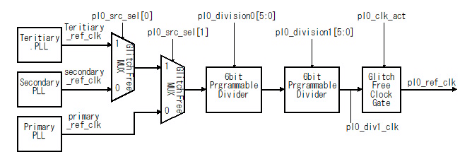
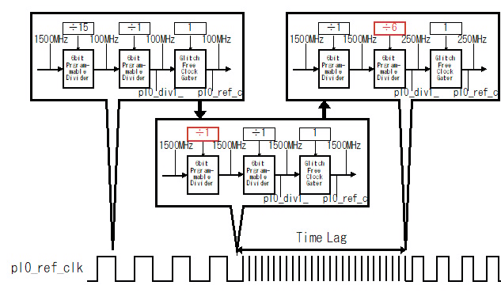
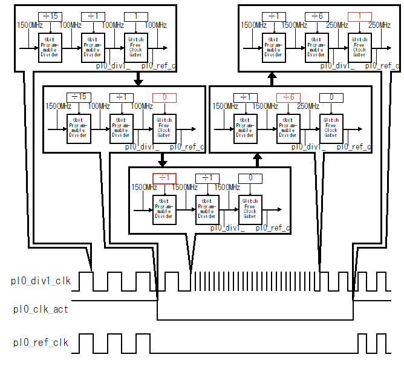

FPGA Clock Configuration Device Driver
======================================

# Overview

## fclkcfg

fclkcfg, which stands for FPGA Clock Configuration, is a device driver that enables
user-space configuration of clock supplied to Programmable Logic (PL) of Zynq/Zynq UltraScale+.

## Architecture

`fclkcfg` exposes Linux Kernel's `clk` driver functions to user space so that PL clock configuration
can be done from the user space.


Fig.1 Architecture of fclkcfg

## Supported platforms

*  OS: Linux Kernel Version 4.4.4 or later
*  CPU: ARM(Zynq-7000), ARM64(Zynq UltraScale+)

Note: fclkcfg is being tested on Altera-SoC as of 2016-04-08, but not confirmed to fully work on the platform.

# Install

## Build

The repository contains an example `Makefile`, which could be modified depending on the target platform and/or
the build tool chain.

## Install on Linux

The `fclkcfg` kernel object can be loaded via the `insmod` command.

When loaded, device drivers are instantiated based on the configuration in a device tree overlay.
See the following section for details of the device tree overlay.

```console
zynq# insmod fclkcfg.ko
[  102.044387] fclkcfg amba:fclk0: driver installed.
[  102.049016] fclkcfg amba:fclk0: device name   : fclk0
[  102.053949] fclkcfg amba:fclk0: clock  name   : fclk0
[  102.058748] fclkcfg amba:fclk0: clock  rate   : 100000000
[  102.058748] fclkcfg amba:fclk0: clock  enable : 1
```

## Uninstall

The loaded module can be removed using the `rmmod` command.

```console
zynq# rmmod fclkcfg
[  261.514039] fclkcfg amba:fclk0: driver unloaded
```

## Installation with the Debian package

For details, refer to the following URL.

*  https://github.com/ikwzm/fclkcfg-kmod-dpkg

# Device Tree

Configuration of clock (frequency, enable/disable status) can be passed as a device tree overlay blob.
The following is an example device tree overlay source `dts` that configures `clk0` to be 100 MHz.

```devicetree:devicetree.dts
        fclk0 {
            compatible    = "ikwzm,fclkcfg";
            device-name   = "fpga-clk0";
            clocks        = <&clkc 15>, <&clkc 2>;
            insert-rate   = "100000000";
            insert-enable = <1>;
            remove-rate   = "1000000";
            remove-enable = <0>;
        };
```

The subsections below describe details of the properties configurable in the device tree overlay.


## `compatible` property

The `compatible` property specifies a keyword which is used to find an appropriate device driver
among available kernel module. For `fclkcfg`, this field is mandatory and shall contain
`"ikwzm,fclkcfg-0.10.a"` or `"ikwzm,fclkcfg"`. (Prior to v1.6.0, only `"ikwzm,fclkcfg-0.10.a"` could be used. After v1.6.0, `"ikwzm,fclkcfg"` also can be used).

## `device-name` property

`device-name` is a optional property that specifies a name give to a created device. 
 When the `device-name` property is not specified, the device tree node name (`fclk0` in the
 above example) will be used as a name.


## `clocks` property

The `clock` property takes a target clock to be configured as a first argument, and
its resource clocks as a second and subsequent arguments (optional).
The `clock` property is a mandatory field in the `fclkcfg` device tree overlay entry.

Clocks passed to the `clocks` property should be in the format of `<clock_handle clock_index>`, e.g. `<&clkc 15>`.

For example, in the case of Zynq, the clock list is defined as follows in the device tree.

```devicetree:zynq-7000.dtsi
/dts-v1/;
        :
          ...
        :
        slcr: slcr@f8000000 {
            #address-cells = <1>;
            #size-cells = <1>;
            compatible = "xlnx,zynq-slcr", "syscon", "simple-bus";
            reg = <0xF8000000 0x1000>;
            ranges;
            clkc: clkc@100 {
                #clock-cells = <1>;
                compatible = "xlnx,ps7-clkc";
                fclk-enable = <0>;
                clock-output-names = "armpll", "ddrpll", "iopll", "cpu_6or4x",
                        "cpu_3or2x", "cpu_2x", "cpu_1x", "ddr2x", "ddr3x",
                        "dci", "lqspi", "smc", "pcap", "gem0", "gem1",
                        "fclk0", "fclk1", "fclk2", "fclk3", "can0", "can1",
                        "sdio0", "sdio1", "uart0", "uart1", "spi0", "spi1",
                        "dma", "usb0_aper", "usb1_aper", "gem0_aper",
                        "gem1_aper", "sdio0_aper", "sdio1_aper",
                        "spi0_aper", "spi1_aper", "can0_aper", "can1_aper",
                        "i2c0_aper", "i2c1_aper", "uart0_aper", "uart1_aper",
                        "gpio_aper", "lqspi_aper", "smc_aper", "swdt",
                        "dbg_trc", "dbg_apb";
                reg = <0x100 0x100>;
            };
        :
          ...
        :
```

When the above device tree is loaded, clock configuration should be done via `slcr`'s (System Level Control Register's) `clkc`.
`clocks = <&clkc 15>;`, in this case, corresponds to the 15th entry (note the number is zero-indexed) of the clock list,
namely `fclk0` or equivalently PL Clock 0.

The second and subsequent arguments of `clocks` specifies a resource clock of the PL clock to be generated.
Either of "armpll" (`<&clkc 0>`), "ddrpll" (`<&clkc 1>`), or "iopll" (`<&clkc 2>`}) can be a resource clock.
For example, `clocks = <&clkc 16>, <&clkc 2>;` means that `clkc`'s 16th clock (again, note zero-indexed),
namely `fclk1` (i.e. PL Clock 1) is specified as the target of generation, based on the 2nd entry of the
`clkc`'s clock list, namely i.e. "iopll".

When the second and subsequent arguments is unspecified, a resource clock that is selected up on Linux boot up is used as a resource clock.

The "phandle" integer number, which is assigned when a decive tree source is compiled to device tree blob by dtc (Device Tree Compiler), can also be used in place of the symbol representation like `&clkc`. For instance, if `clkc` is assigned a phandle number of 5 by dtc, `clocks = <5 15>` has the same meaning as `clocks = <&clkc 15>`, and can be used to control PL Clock 0.

Sometimes symbol definitions can be removed from a compiled device tree blob, and in such cases, the symbol representation like `&clkc` cannot be used, and therefore, a phandle number should be explicitly specified in the device tree overlay as follows:


```devicetree:fclk0-zynq-zybo.dts
/dts-v1/;
/ {
    fragment@0 {
        target-path = "/amba";
        __overlay__ {
            fclk0 {
                compatible  = "ikwzm,fclkcfg";
                clocks      = <5 15>;
            };
        };
    };
};
```

### Clock properties for Zynq

The following table lists clocks that are defined in the Zynq device tree and can be passed to the `clock` property.

Table.1 Zynq clocks

| Clock Name  | Index  | Property Value   | Description |
|-------------|--------|------------------|-------------|
| armpll      | 0      | <&clkc 0>        | ARMPLL. Can be specified as a "resource clock" (optional) |
| ddrpll      | 1      | <&clkc 1>        | DDRPLL. Can be specified as a "resource clock" (optional) |
| iopll       | 2      | <&clkc 2>        | IOPLL. Can be specified as a "resource clock" (optional) |
| fclk0       | 15     | <&clkc 15>       | PL Clock 0. |
| fclk1       | 16     | <&clkc 16>       | PL Clock 1. |
| fclk2       | 17     | <&clkc 17>       | PL Clock 2. |
| fclk3       | 18     | <&clkc 18>       | PL Clock 3. |


### Clock properties for ZynqMP

The following table lists clocks that are defined in the ZynqMP device tree and can be passed to the `clock` property.

Table.2 ZynqMP clocks(linux-xlnx v2018.2)

| Clock Name  | Index  | Property Value   | Description |
|-------------|--------|------------------|-------------|
| iopll       | 0      | <&clkc 0>        | IOPLL. Can be specified as a "resource clock" (optional) |
| rpll        | 1      | <&clkc 1>        | RPLL. Can be specified as a "resource clock" (optional) |
| dpll_to_lpd | 8      | <&clkc 8>        | DPLL. Can be specified as a "resource clock" (optional) |
| pl0_ref     | 71     | <&clkc 71>       | PL Clock 0. |
| pl1_ref     | 72     | <&clkc 72>       | PL Clock 1. |
| pl2_ref     | 73     | <&clkc 73>       | PL Clock 2. |
| pl3_ref     | 74     | <&clkc 74>       | PL Clock 3. |


Table.3 ZynqMP clocks(linux-xlnx v2019.1)

| Clock Name  | Index  | Property Value   | Description |
|-------------|--------|------------------|-------------|
| iopll       | 0      | <&zynqmp_clk 0>  | IOPLL. Can be specified as a "resource clock" (optional) |
| rpll        | 1      | <&zynqmp_clk 1>  | RPLL. Can be specified as a "resource clock" (optional) |
| dpll_to_lpd | 8      | <&zynqmp_clk 8>  | DPLL. Can be specified as a "resource clock" (optional) |
| pl0_ref     | 71     | <&zynqmp_clk 71> | PL Clock 0. |
| pl1_ref     | 72     | <&zynqmp_clk 72> | PL Clock 1. |
| pl2_ref     | 73     | <&zynqmp_clk 73> | PL Clock 2. |
| pl3_ref     | 74     | <&zynqmp_clk 74> | PL Clock 3. |

## `insert-rate` property

The `insert-rate` property specifies a frequency of the clock that is generated when the clock device is installed.
A double-quoted string value (in Hz) should be passed to the property. The following snippet shows an example of
setting a clock frequency with 100 MHz to PL Clock 0 (on Zybo).

```devicetree:fclk0-zynq-zybo.dts
/dts-v1/;/plugin/;
/ {
    fragment@0 {
        target-path = "/amba";
        __overlay__ {
            fclk0 {
                compatible  = "ikwzm,fclkcfg";
                clocks      = <&clkc 15>;
                insert-rate = "100000000";
            };
        };
    };
};
```

The `insert-rate` property is optional, and when omitted, the output clock frequency is not changed from the present value.

## `insert-enable` property

The `insert-enable` property controls the output status of the clock when the clock device is installed.
`<1>` and `<0>` mean enable output and disable output up on installation, respectively.
The following example enables clock output up on installation of the clock device.

```devicetree:fclk0-zynq-zybo.dts
/dts-v1/;/plugin/;
/ {
    fragment@0 {
        target-path = "/amba";
        __overlay__ {
            fclk0 {
                compatible    = "ikwzm,fclkcfg";
                clocks        = <&clkc 15>;
                insert-enable = <1>;
            };
        };
    };
};
```

The `insert-enable` property is optional, and when omitted, the clock output is disabled up on installation.

## `insert-resource` property

The `insert-resource` property specifies a resource clock that is generated when the clock device is installed.
The `insert-resource` property only has an effect if the `clocks` property has second and subsequent arguments.
The `insert-resource` property is an integer. The position of the second argment of the `clocks` property is `<0>`, and thereafter, the the third argment is `<1>`, and the fourth argment is `<2>`.

For example, in the device tree below, the resource clock is set to `<&clk 1>`.

```devicetree:fclk0-zynq-zybo.dts
        fclk0 {
            compatible      = "ikwzm,fclkcfg";
            device-name     = "fpga-clk0";
            clocks          = <&clkc 15>, <&clkc 0>, <&clkc 1>, <&clkc 2>;
            insert-resource = <1>;  // <0>: <&clkc 0>, <1>: <&clkc 1>, <2>: <&clkc 2>,
            insert-rate     = "25000000";
        };
```

The `insert-resouce` property is optional and defaults to `<0>`. In this case, if the `clocks` property has more than the second argument, the clock specified by the second argument will be set as the resource clock. Also, if the `clocks` property has only the first argument, the resource clock will not be changed.

## `remove-rate` property

The `remove-rate` property specifies a frequency of the clock that is generated when the clock device is removed.
A double-quoted string value (in Hz) should be passed to the property. The following snippet shows an example of
setting a clock frequency with 1 MHz to PL Clock 0 (on Zybo) up on removal.

```devicetree:fclk0-zynq-zybo.dts
/dts-v1/;/plugin/;
/ {
    fragment@0 {
        target-path = "/amba";
        __overlay__ {
            fclk0 {
                compatible    = "ikwzm,fclkcfg";
                clocks        = <&clkc 15>;
                remove-rate   = "1000000";
            };
        };
    };
};
```

The `remove-rate` property is optional, and when omitted, the output clock frequency will stay unchanged
when the clock device is removed.

## `remove-enable` property

The `remove-enable` property controls the output status of the clock when the clock device is removed.
`<1>` and `<0>` mean enable output and disable output up on removal, respectively.
The following example stops clock output up on removal of the clock device.

```devicetree:fclk0-zynq-zybo.dts
/dts-v1/;/plugin/;
/ {
    fragment@0 {
        target-path = "/amba";
        __overlay__ {
            fclk0 {
                compatible    = "ikwzm,fclkcfg";
                clocks        = <&clkc 15>;
                remove-enable = <0>;
            };
        };
    };
};
```

The `remove-enable` property is optional, and when omitted, the clock output will be disabled up on
removal of the clock device.


## `remove-resource` property

The `remove-resource` property specifies a resource clock when the clock device is removed.
The `remove-resource` property only has an effect if the `clocks` property has second and subsequent arguments.
The `remove-resource` property is an integer. The position of the second argment of the `clocks` property is `<0>`, and thereafter, the the third argment is `<1>`, and the fourth argment is `<2>`.

For example, in the device tree below, the resource clock is set to `<&clk 1>`.

```devicetree:fclk0-zynq-zybo.dts
        fclk0 {
            compatible      = "ikwzm,fclkcfg";
            device-name     = "fpga-clk0";
            clocks          = <&clkc 15>, <&clkc 0>, <&clkc 1>, <&clkc 2>;
            remove-resource = <1>;  // <0>: <&clkc 0>, <1>: <&clkc 1>, <2>: <&clkc 2>,
            remove-rate     = "25000000";
        };
```

The `remove-resouce` property is optional, and when omitted, the resource clock is unchanged when the clock device is removed.

# Device files

When `fclkcfg` is installed and a device tree entry is loaded (via e.g. device tree overlay), the following device
files will be created. `\<device-name\>` reads the device name specified in the device tree entry.

  *  `/sys/class/fclkcfg/\<device-name\>/enable`
  *  `/sys/class/fclkcfg/\<device-name\>/rate`
  *  `/sys/class/fclkcfg/\<device-name\>/round_rate`
  *  `/sys/class/fclkcfg/\<device-name\>/resource`
  *  `/sys/class/fclkcfg/\<device-name\>/resource_clks`
  *  `/sys/class/fclkcfg/\<device-name\>/remove_rate`
  *  `/sys/class/fclkcfg/\<device-name\>/remove_enable`
  *  `/sys/class/fclkcfg/\<device-name\>/remove_resource`

## /sys/class/fclkcfg/\<device-name\>/enable

The file is used to controls the output status of the clock. When `1` and `0` are written, the clock output will be
enabled and disabled, respectively. When the file is read, the output status is returned (again, `1` means output enable).

```console
zynq# echo 1 > /sys/class/fclkcfg/fclk0/enable
zynq# cat /sys/class/fclkcfg/fclk0/enable
1
zynq# echo 0 > /sys/class/fclkcfg/fclk0/enable
zynq# cat /sys/class/fclkcfg/fclk0/enable
0
```

## /sys/class/fclkcfg/\<device-name\>/rate

This file is used to change the output clock frequency. The following example selects an output frequency of 100 MHz.

```console
zynq# echo 100000000 > /sys/class/fclkcfg/fclk0/rate
zynq# cat /sys/class/fclkcfg/fclk0/rate
100000000
```

Note that, due to the limitations of the PLL, it is possible that a desired clock frequency cannot be achieved.
For example, Zybo cannot synthesize 133 MHz clock, and when a 133 MHz clock output is requested,
an actual output frequency becomes 125 MHz.

```console
zynq# echo 133333333 > /sys/class/fclkcfg/fclk0/rate
zynq# cat /sys/class/fclkcfg/fclk0/rate
125000000
```

## /sys/class/fclkcfg/\<device-name\>/round_rate

As described above, not all desired output frequency can be achieved due to the limitations of the PLL.
To know an actual output frequency, one can write a desired clock frequency to this file, followed by a read access.

```console
zynq# echo 133333333 > /sys/class/fclkcfg/fclk0/round_rate
zynq# cat /sys/class/fclkcfg/fclk0/round_rate
133333333 => 125000000
zynq# echo  75000000 > /sys/class/fclkcfg/fclk0/round_rate
zynq# cat /sys/class/fclkcfg/fclk0/round_rate
75000000 => 71428572
```

## /sys/class/fclkcfg/\<device-name\>/resource

This file is used to change the resource clock. The following example the resource clock is changed to 1.

```console
zynq# echo 1 > /sys/class/fclkcfg/fclk0/resource
zynq# cat /sys/class/fclkcfg/fclk0/resource
1
```

## /sys/class/fclkcfg/\<device-name\>/resource_clks

By reading this file, you can get the names of the resource clocks that you can select.

```console
zynq# cat /sys/class/fclkcfg/fclk0/resource_clks
armpll, ddrpll, iopll
```

## /sys/class/fclkcfg/\<device-name\>/remove_rate

This file is used to change the output clock frequency when the clock device is removed.
The following example selects an output frequency of 100 MHz when the clock device is removed.

```console
zynq# echo 100000000 > /sys/class/fclkcfg/fclk0/remove_rate
zynq# cat /sys/class/fclkcfg/fclk0/remove_rate
100000000
```

Writing a negative value to this file will not change the frequency when the clock device is removed.


## /sys/class/fclkcfg/\<device-name\>/remove_enable

This file controls the output status of the clock when the clock device is removed.

Writing 1 will output the clock when the clock device is removed.
Writing 0 will stop the clock when the clock device is removed.
Writing -1 does not control the clock when the clock device is removed.


## /sys/class/fclkcfg/\<device-name\>/remove_resource

The file specifies a resource clock when the clock device is removed.
The file only has an effect if the `clocks` property has second and subsequent arguments.

Writing a value of 0 or greater changes to the resource clock specified when the clock device was removed.
Writing a negative value does not change the resource clock when the clock device is removed.

# Changing the clock frequency safely

## Example of unsafely frequency change (PLL case)

A PLL (Phase-Locked Loop) frequency synthesizer creates an output clock signal with an accurate frequency by digitally setting the frequency multiplication factor to be added or subtracted from the input clock signal.
The PLL generates a clock with the desired frequency by feeding back the output clock signal and adjusting the phase difference with the input clock signal. Generally, it takes some time to adjust the phase, and the output clock frequency becomes unstable during the adjustment. If this clock is output as it is, the circuit running on that clock may malfunction.

")

Fig.2 ADPLL(All Digital Phase-Locked Loop)


## Example of unsafely frequency change (ZynqMP case)

The FPGA clock generation circuit of ZynqMP has the following structure. The feature is that two independent Dividers are connected.



Fig.3 ZynqMP Clock Generator Block Diagram

However, if there is a time lag in the time to set each Divider, it is possible to output a clock with an unintended frequency.

For example, suppose that the Primary PLL is set to 1000MHz, pl0_division0 is set to 10, and Pl0_division1 is set to 1. In this case, the frequency of the output clock is 100MHz (=(1000MHz÷10)÷1). Now suppose you change the frequency to 250MHz. If you set pl0_division0 to 1 and then set pl0_division1 to 4 as shown in the following figure, 1000MHz clock is output from the setting of pl0_divison0 to the setting of pl1_division1. And there is a possibility that the circuit that operates with that clock may malfunction.



Fig.4 Example of ZynqMP output an unintended frequency clock


## Changing the clock frequency safely with fclkcfg

When changing the frequency, `fclkcfg` stops the clock output before changing the frequency. Then, after changing the frequency, the clock is output. By preventing the output of a clock with an unintended frequency in this way, it is possible to prevent malfunction of the circuit that operates with that clock.



Fig.5 Changing the clock frequency safely with fclkcfg

# Reference

* [FPGA Clock Configuration Device Driver(https://github.com/ikwzm/fclkcfg)](https://github.com/ikwzm/fclkcfg)
* [fclkcfg kernel module debian package(https://github.com/ikwzm/fclkcfg-kmod-dpkg)](https://github.com/ikwzm/fclkcfg-kmod-dpkg)
* [The boot sequence of FPGA+SoC+Linux (ZYNQ+U-Boot-SPL) @ Qiita](http://qiita.com/ikwzm/items/efacec8d8e0744e17d45) (Japanese)
* [Manage Zynq PL clock and reset signal from U-Boot @ Qiita](http://qiita.com/ikwzm/items/3253940484591da84777) (Japanese)
* [Device Tree Overlay tested on FPGA+SoC+Linux @ Qiita](http://qiita.com/ikwzm/items/ec514e955c16076327ce) (Japanese)
